# Face Recognition System - Technical Architecture

This document explains how the facial recognition system processes images, stores face data, and performs matching.

---

## Table of Contents

1. [System Overview](#system-overview)
2. [Image Processing Pipeline](#image-processing-pipeline)
3. [Face Embedding Generation](#face-embedding-generation)
4. [Vector Storage in PostgreSQL](#vector-storage-in-postgresql)
5. [Face Matching Algorithm](#face-matching-algorithm)
6. [Complete Flow Diagrams](#complete-flow-diagrams)

---

## System Overview

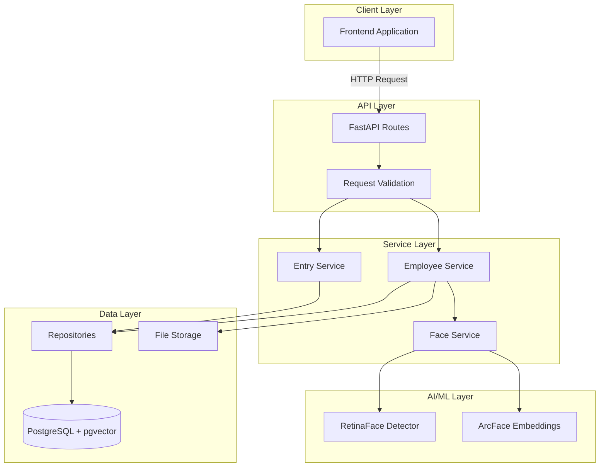

---

## Image Processing Pipeline

When an image is uploaded to the system, it goes through several processing stages before a face can be detected and converted to a vector.

### Stage 1: Image Validation

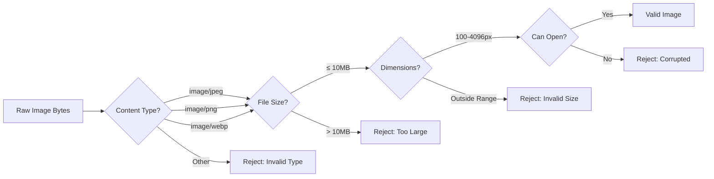

**Validation Rules:**
| Check | Requirement |
|-------|-------------|
| Content Type | `image/jpeg`, `image/png`, `image/webp` |
| File Size | ≤ 10 MB |
| Min Dimension | 100 × 100 pixels |
| Max Dimension | 4096 × 4096 pixels |
| Format | Must be readable by PIL |

### Stage 2: Image Preprocessing

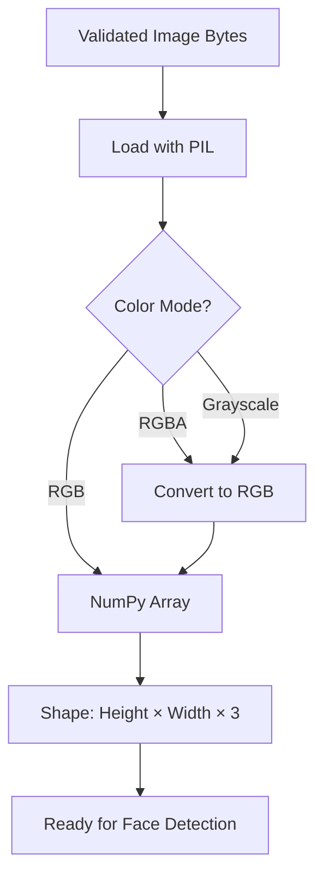

**Code Reference:**
```python
def bytes_to_numpy(image_bytes: bytes) -> np.ndarray:
    img = Image.open(io.BytesIO(image_bytes))
    if img.mode != "RGB":
        img = img.convert("RGB")
    return np.array(img)  # Shape: (H, W, 3)
```

---

## Face Embedding Generation

### What is a Face Embedding?

A face embedding is a **512-dimensional numerical vector** that represents the unique features of a face. Think of it as a "fingerprint" for the face.

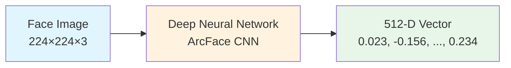

### Face Detection Process (RetinaFace)

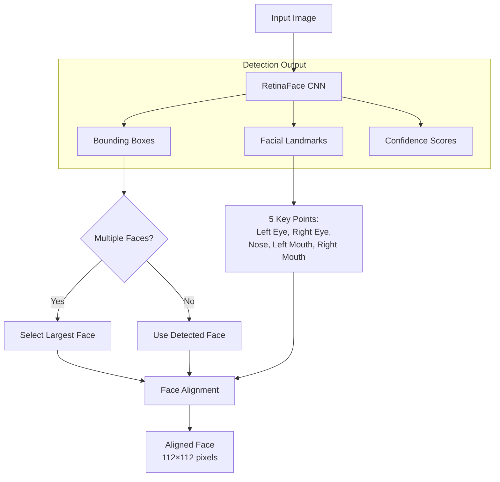

### Embedding Generation Process (ArcFace)

```mermaid
flowchart TD
    A[Aligned Face<br/>112×112×3] --> B[Normalize Pixels<br/>0-255 → -1 to 1]
    
    B --> C[ArcFace CNN]
    
    subgraph "Neural Network Layers"
        C --> D[Conv Layers<br/>Feature Extraction]
        D --> E[Residual Blocks<br/>Deep Features]
        E --> F[Global Average Pool]
        F --> G[Fully Connected<br/>512 neurons]
    end
    
    G --> H[L2 Normalization]
    H --> I[512-D Unit Vector<br/>||v|| = 1]
    
    style I fill:#c8e6c9
```

### What Each Dimension Represents

The 512 dimensions capture abstract facial features learned by the neural network:

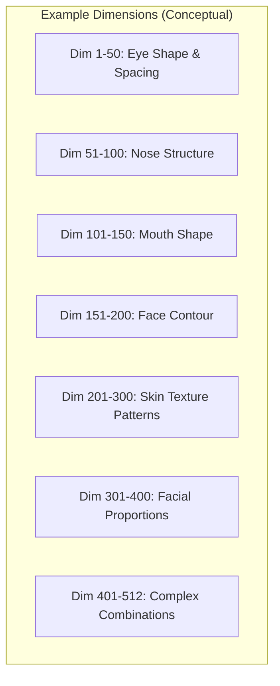

> **Note:** These are conceptual groupings. In reality, each dimension captures a complex combination of features learned during training on millions of faces.

---

## Vector Storage in PostgreSQL

### Database Schema

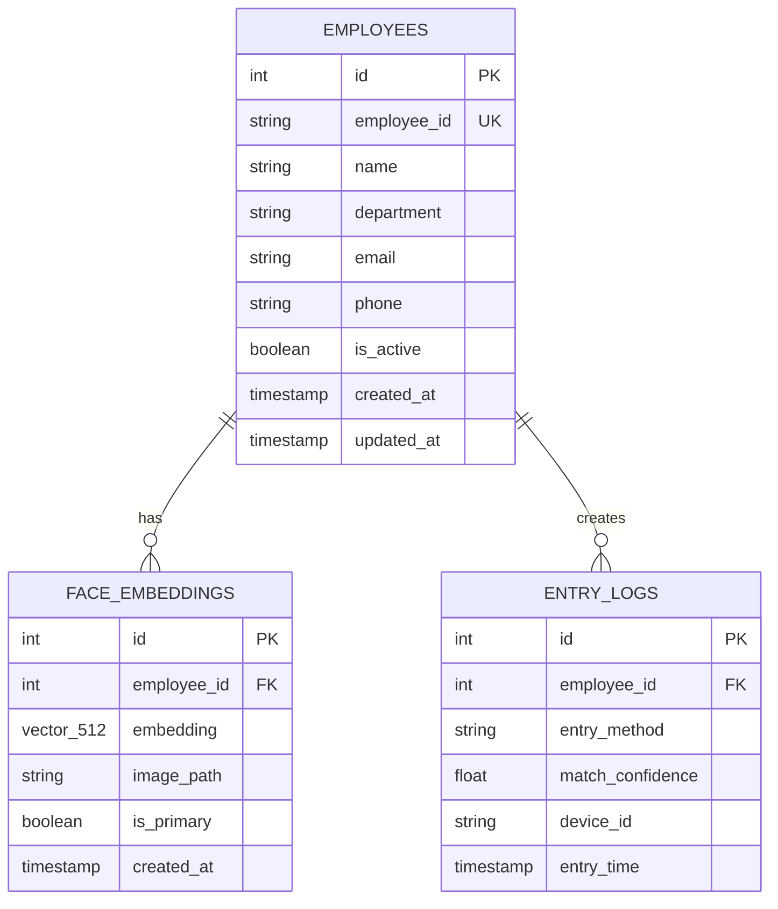

### How pgvector Stores Vectors

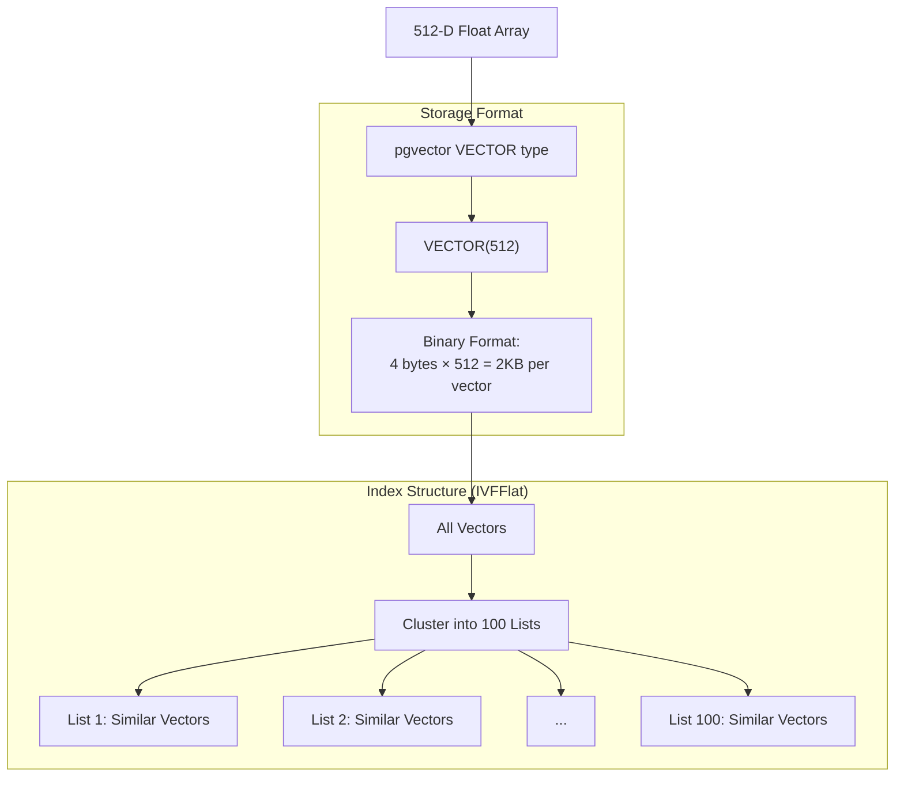

### SQL Operations

**Storing an Embedding:**
```sql
INSERT INTO face_embeddings (employee_id, embedding, image_path, is_primary)
VALUES (
    1,
    '[0.023, -0.156, 0.089, ..., 0.234]'::vector,
    'face_images/EMP-001/primary_abc123.jpg',
    true
);
```

**Creating the Index:**
```sql
CREATE INDEX face_embedding_idx 
ON face_embeddings 
USING ivfflat (embedding vector_cosine_ops) 
WITH (lists = 100);
```

---

## Face Matching Algorithm

### Cosine Distance Explained

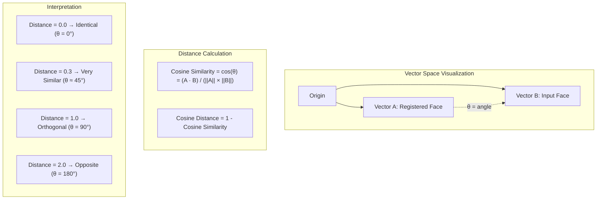

### Distance to Confidence Conversion

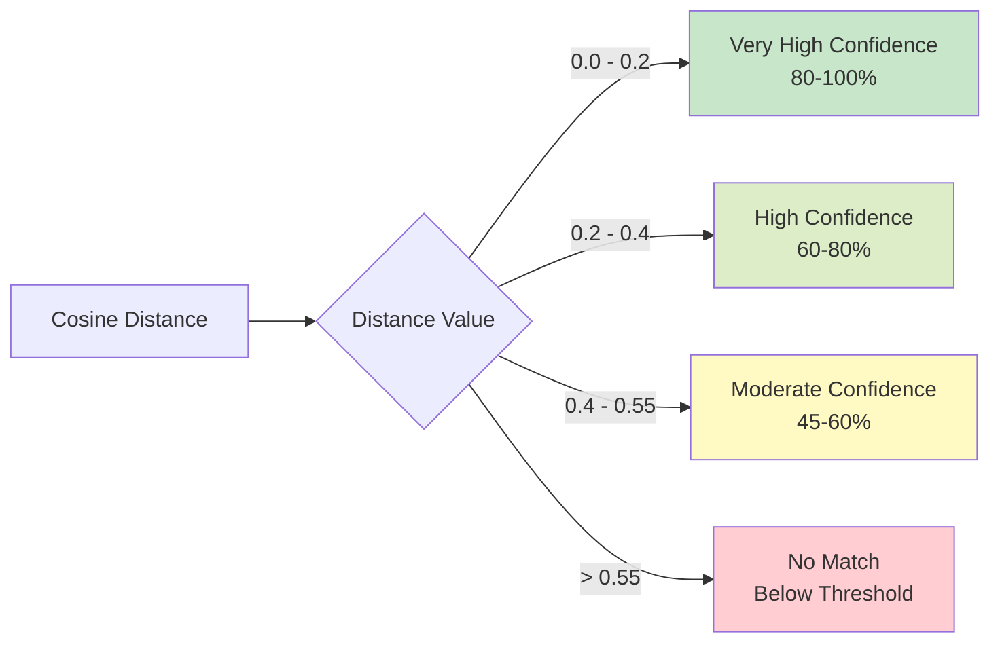

**Conversion Formula:**
```
Confidence = 1 - Distance

Examples:
- Distance 0.15 → Confidence 85%
- Distance 0.30 → Confidence 70%
- Distance 0.50 → Confidence 50%
```

### Matching Query Process

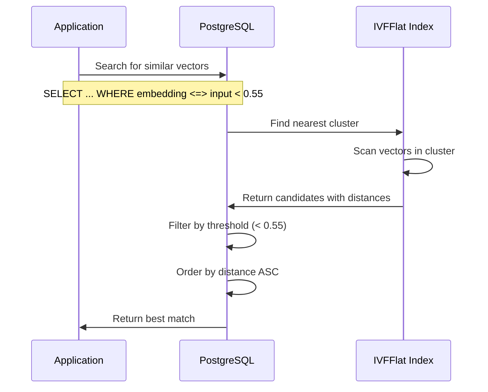

**SQL Query:**
```sql
SELECT 
    fe.id,
    e.employee_id,
    e.name,
    fe.embedding <=> '[input_vector]'::vector AS distance
FROM face_embeddings fe
JOIN employees e ON fe.employee_id = e.id
WHERE e.is_active = true
  AND fe.embedding <=> '[input_vector]'::vector < 0.55
ORDER BY distance ASC
LIMIT 1;
```

---

## Complete Flow Diagrams

### Employee Registration Flow

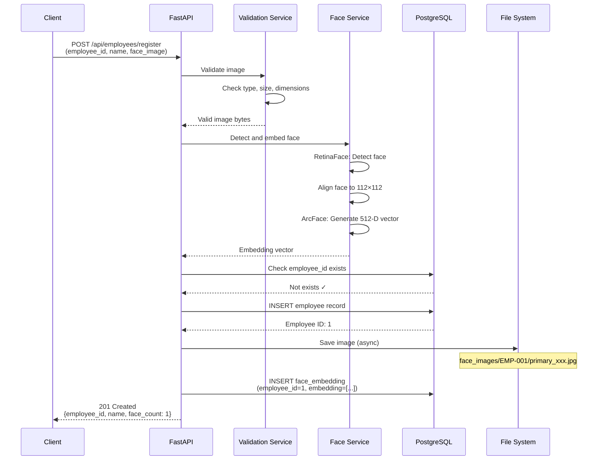

### Face Recognition Flow

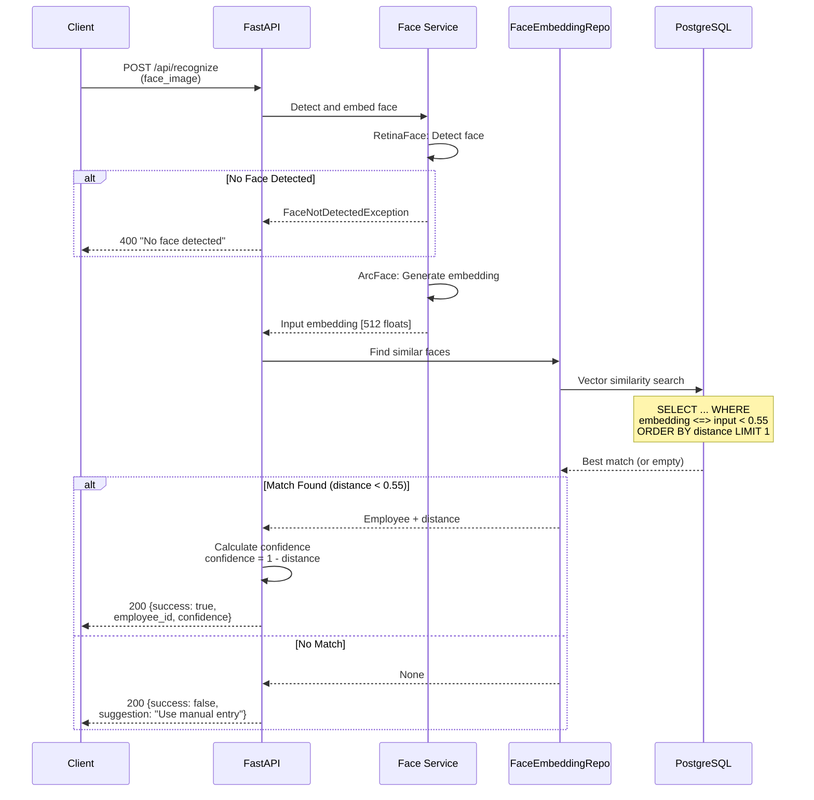

### Manual Entry Fallback Flow

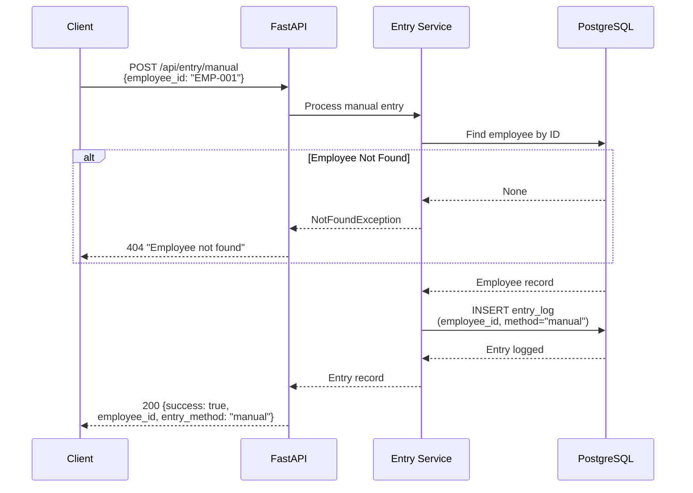

---

## Performance Characteristics

### Time Complexity

```mermaid
graph TD
    subgraph "Without Index"
        A[Linear Scan: O(n)]
        A --> B[1000 faces ≈ 50ms]
        A --> C[10000 faces ≈ 500ms]
        A --> D[100000 faces ≈ 5s]
    end
    
    subgraph "With IVFFlat Index"
        E[Approximate: O(√n)]
        E --> F[1000 faces ≈ 5ms]
        E --> G[10000 faces ≈ 15ms]
        E --> H[100000 faces ≈ 50ms]
    end
    
    style E fill:#c8e6c9
    style F fill:#c8e6c9
    style G fill:#c8e6c9
    style H fill:#c8e6c9
```

### Memory Usage

| Component | Size |
|-----------|------|
| Single embedding | 512 × 4 bytes = 2 KB |
| 1,000 employees | ~2 MB |
| 10,000 employees | ~20 MB |
| IVFFlat index overhead | ~10-20% |

---

## Summary


**Key Takeaways:**

1. **Face Detection**: RetinaFace locates and aligns faces in images
2. **Embedding**: ArcFace converts faces to 512-dimensional vectors
3. **Storage**: pgvector stores vectors with efficient indexing
4. **Matching**: Cosine distance measures similarity (lower = more similar)
5. **Threshold**: 0.55 balances accuracy and false positive rate
